# AuthenticationServer
AuthenticationServer is a **JWT** based User Session Management, it Support Role Based Access Control - RBAC, This module is the Single Sign-On service

# Requirement
Given Tenant ID, 
1. User registry credentials(password) with the user name and email. email is the unique key Identity
2. User uses username and password to login, then get JWT token wrapping the below information:  
    user name, groups that he belongs to, roles that are assigned to this user, and policies under this user.
3. Renew token and validate the token
4. Token lifecycle is 30mins as default.
5. Role and policy please refer to detail requirements from RBAC.

# JWT
Json web token (JWT), is an open standard based on JSON ((RFC 7519) that is implemented to pass declarations between web application environments. It defines a concise, self-contained method for communication between two parties The form of JSON object can safely transmit information. Because of the existence of digital signature, the information is trusted, JWT can use HMAC algorithm or RSA public and private key pair to sign.
+ JWT request process
    1. The user sends a post request using the account and password;
    2. The server uses the private key to create a jwt;
    3. The server returns this jwt to the browser;
    4. The browser sends the jwt string in the request header like the server to send the request;
    5. The server verifies the jwt;
    6. Return the corresponding resource to the browser.
+ Common scenarios of JWT  
Identity authentication In this scenario, once the user completes the login, the JWT is included in each subsequent request, which can be used to verify the user's identity and verify the access rights of routing, services, and resources. Because of its very small overhead, it can be easily transmitted in systems of different domain names. Currently, this technology is widely used in single sign-on (SSO). Information exchange It is a very safe way to use JWT to encode data between the two parties in the communication. Since its information is signed, it can ensure that the information sent by the sender has not been forged.
+ Advantages
    1. Compact: It can be sent through URL, POST parameters or in HTTP header, because the amount of data is small and the transmission speed is very fast.
    2. Self-contained: The load contains all the information needed by users, avoiding multiple queries to the database
    3. Because the Token is stored on the client in the form of JSON encryption, JWT is cross-language, and in principle, any web format is supported.
    4. There is no need to save session information on the server side, which is especially suitable for distributed microservices.

+ The process of stateless login:
    1. When the client requests the service for the first time, the server authenticates the user (login).
    2. After the authentication is passed, the user information is encrypted to form a token, which is returned to the client as a login credential.
    3. For each subsequent request, the client carries the authentication token.
    4. The server decrypts the token and judges whether it is valid.

# ArangoDB
ArangoDB is a native multi-model database that has both key/value pairs, graphs and document data models. It provides a unified database query language covering three data models, and allows the three to be mixed in a single query Model. Based on its local integrated multi-model feature, you can build high-performance programs, and all three data models support horizontal expansion.  
Data sheet design:  
+ User (id, username, email, password, groupid, roleid)  
+ Token(id,email,token)  

# Class Diagram
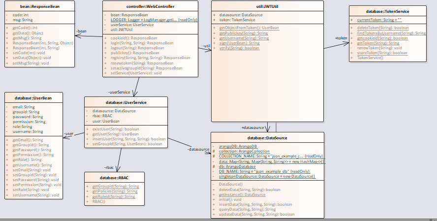
### 1. WebController  
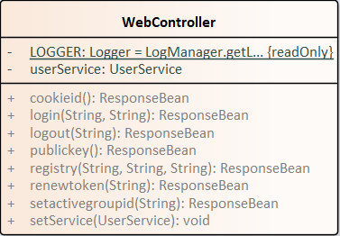
### 2. ResponseBean  
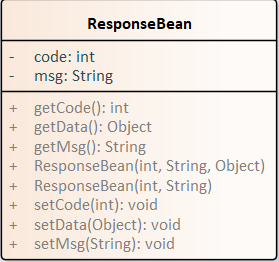
### 3. ResponseBean  

### 4. DataSource  
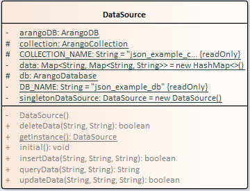
### 5. UserBean  
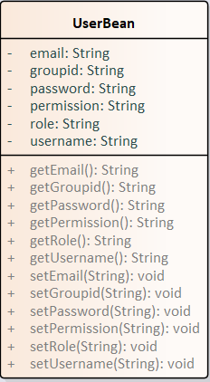
### 6. UserService  
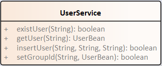
### 7. JWTUtil  
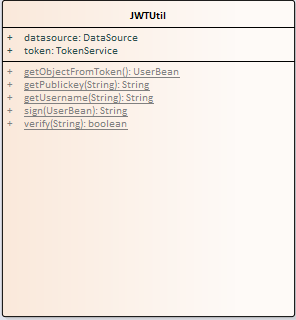
### 8. TokenService  
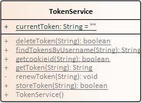
### 9. RBAC  
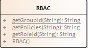

# Scenario
## 1. Registry  
The user calls the registry interface through the restful api, and the user registration information includes user name, email, password, etc., among which email is a unique key. When registering, the system first needs to check the database to verify whether the user’s mailbox already exists. If it already exists, it proves that the user has already registered. Please log in with the user name and password. Otherwise, the system records the user information in the database.  
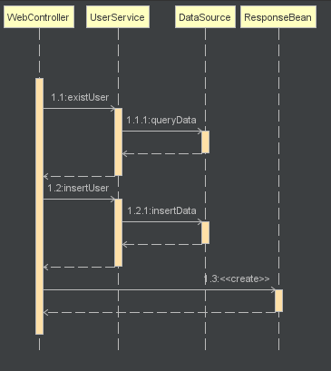

## 2. Login  
The user calls the login interface through the restful api. When the system logs in, first check whether the user name and password exist and match through the database. When the authentication is passed, the system will generate a JWT Token based on username, groupid, roleid, policies and other information, store it in the database, and then return the token value to the browser.  
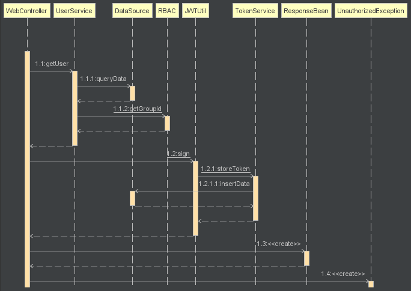

## 3. Logout  
The user calls the logout interface through restful api. When a user logs out, the system deletes the token information of the current user in the database and cache.  
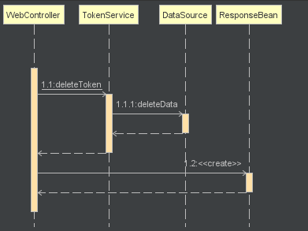

## 4. Renew Token  
The user calls the renewtoken interface through restful api. The default token expiration time of the system is 30 minutes. When the browser needs to re-acquire the token, the system first obtains the JWT token through the header, then parses the token to obtain user information, regenerates the token according to the new time, and then updates the user token in the database and cache Information, and finally return the newly generated token to the browser.  
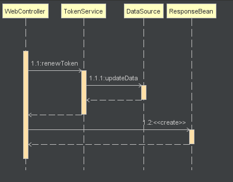

## 5. Get Public Key  
The user calls the Publickey interface through restful api. This interface is used when the client side obtains the public key, and the client side can parse the token information through the obtained public key.  
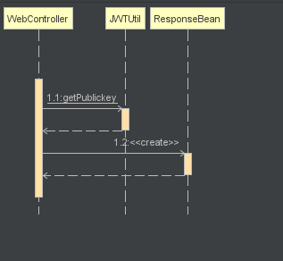

## 6. Get Cookie ID  
The user calls the Cookieid interface through restful api. This interface obtains cookie information on the UI side and saves it in a key-value pair for front-end caching.  
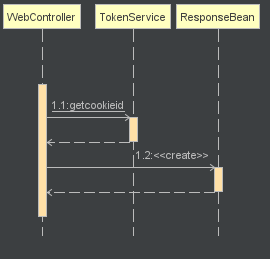

## 7. Set Active Group ID  
The user calls the setacitvegroupid interface through restful api. The system obtains the token information in the header through the interceptor, parses out the corresponding user information, and binds the user information to the groupid passed. Since the RBAC module has not been designed yet, the specific group information is still unclear, and the corresponding modification can be made after the design of the RBAC module in the future.  
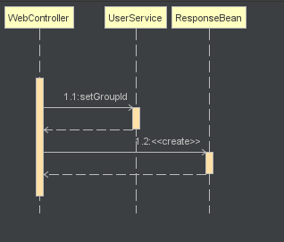

## 8. Token Interceptor  
Configure the interceptor for Springboot, and the system will verify all requests from the browser. The interceptor needs to verify the header information, whether the Token value exists, whether the Token time expires, whether the user exists, etc.  
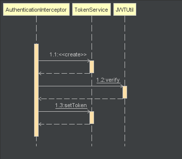

# License

This appplication is under the Apache 2.0 license. See the [LICENSE](LICENSE) file for details..